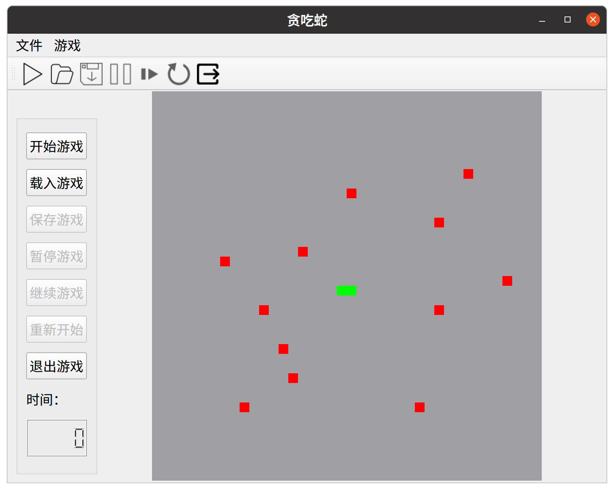

# 贪吃蛇设计文档

计97 胡沐彦 2019013269

## 程序结构

程序主要内容在 `mainwindow.h/mainwindow.cpp` 中实现。

### 类型

+ `enum gameStatus`：游戏状态类型，可以为 `UNSTARTED`、`STARTED`、`PAUSED`、`ENDED`
+ `enum direction`：方向类型，可以为 `UP`、`DOWN`、`LEFT`、`RIGHT`
+ `enum gridType`：格子类型，可以为 `EMPTY`、`SNAKE`、`FOOD`、`HANDICAP`
+ `struct position`：用两个整型表示坐标位置

### 一些重要的变量

+ `gridType grid[Size][Size]`：通过绘制 $40\times 40$ 个正方形来完成游戏界面的设计
  + 每个格子通过不同的颜色代表不同的游戏要素，空格子用 `Qt::gray`，蛇身用 `Qt::green`，障碍用 `Qt::red`，食物用 `Qt::yellow`
+ `QQueue<position> snakePosition`： 记录蛇身的位置，按照加入蛇身的顺序存储，即蛇头为 `back()`、蛇尾为 `front()`

### 函数

+ 事件函数 `paintEvent`、`mousePressEvent`、`keyPressEvent`，具体见下文
+ `setGameStatus(x)`：改变游戏状态
+ `generateFood()`：生成食物
+ `quit()`、`start()`、`pause()`、`resume()`、`restart()`、`save()`、`load()`：为统一 `QAction` 按键和 `QButton` 的效果，在以上函数中实现具体功能，在 `QAction` 和 `QButton` 的槽函数里直接调用以上函数
+ `move()`：令蛇向前移动一格

## 游戏界面

+ 菜单栏和工具栏的按钮用 `QAction` 实现，并在 `QAction` 的icon属性中添加图标
+ 时间的显示用 `LCD Number` 实现
+ $40\times 40$ 的游戏网格利用 `paintEvent` 绘制，根据窗口实际大小绘制 $40\times 40$ 个尽可能大的正方形。具体计算方式如下：
  + 设除去左部按钮、菜单栏、工具栏后的空白区域为 $W\times H$ 的矩形，则每个正方形格子的边长 ${\rm gridSize}=\left\lfloor\frac{\min(W,H)}{40}\right\rfloor$，第 $i$ 行第 $j$ 列格子（下标从 $0$ 开始）的左上角坐标为 $\left(\left\lfloor\frac{W-\min(W,H)}{2}\right\rfloor+i\cdot{\rm gridSize},\left\lfloor\frac{H-\min(W,H)}{2}\right\rfloor+j\cdot{\rm gridSize}\right)$

## 蛇的移动

+ 设置一个每 $200\rm ms$ 发出 `timeout` 信号的 `QTimer`，将 `timeout` 信号与蛇身移动一格的槽函数相连
  + 移动时对吃食物、死亡进行判断
  + 每吃掉一个食物，立刻随机在剩下的空格子中生成一个新的食物
+ 通过一个整型变量 `restLen` 记录吃食物后需要额外移动的格子数，每次移动后如果 `restLen` 不为 $0$ 则将 `restLen` 减 $1$ ，否则删去蛇尾

## 游戏交互

+ 采用 `mousePressEvent` 实现未开始时单击设置障碍，通过鼠标单击的坐标确定设置/取消障碍的格子
+ 游戏时通过 `keyPressEvent` 实现按方向键转向，为防止延迟在按键后立刻 `update()` 重绘，从而也实现了按同方向键加速的特性

## 存档与载入

+ 存档与载入的窗口使用 `QFileDialog::getSaveFileName` 和 `QFileDialog::getOpenFileName`
+ 用二进制文件存档，通过`QFile` 和 `QDataStream` 写入、读取
  + 二进制文件中记录每个格子的颜色、时间、当前方向和记录蛇身的 `QQueue`

## 踩坑记录

+ 方向键直接在 `keyPressEvent` 里判断会因为焦点问题无法生效，需要在 `MainWindow` 构造函数中加一句 `setFocusPolicy(Qt::StrongFocus);`
+ 为使游戏界面支持窗口缩放，需要在绘制时精细地计算绘制大小和位置，同时需要调整按钮的缩放策略
+ 图标需要先加入资源文件再从资源导入，不能直接从路径导入